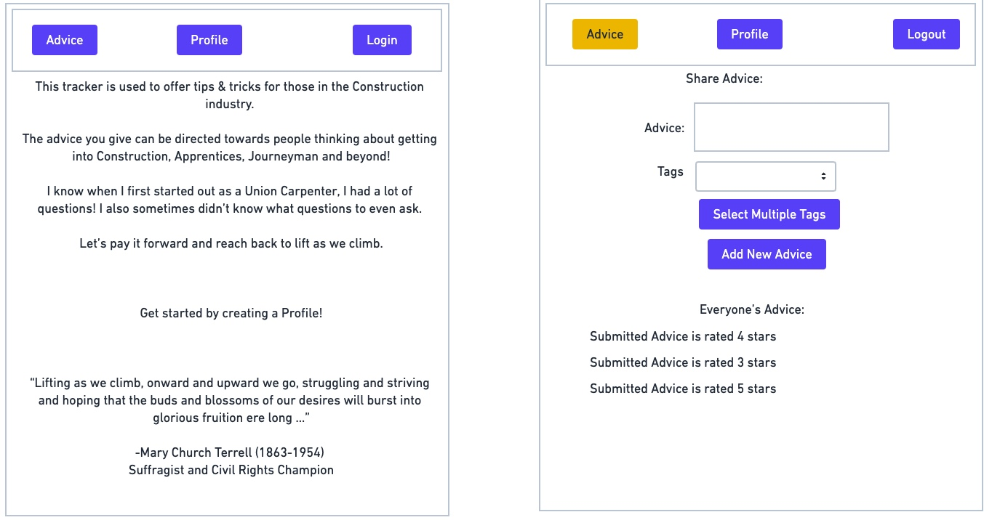
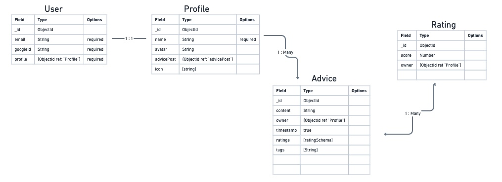

# Construction Advice Tracker

https://construction-advice-tracker.fly.dev

**Overview:**

- This tracker is used to offer tips & tricks for those in the Construction industry. 

- I know when I first started out as a Union Carpenter, I had a lot of questions! I also sometimes didn’t know what questions to even ask. 

- Let’s pay it forward and reach back to lift as we climb.

---------------------------------------------------------------

 **Technology Used & Sources:** 
 
 - VS Code, GitHub, CSS, Javascript, HTML, Google Image Search

 - Modified Star Rating CSS code from https://github.com/mukulkant/Star-rating-using-pure-css 

---------------------------------------------------------------

 **Wireframe Mock-Up Photos:**

---------------------------------------------------------------

**ERD Layout:**

---------------------------------------------------------------
 
 **Future Developments:**

 - Add more Tag Terms
 - Add more elements to the Bio section
 - Add more interactive elements between Profiles
 - More styling overall